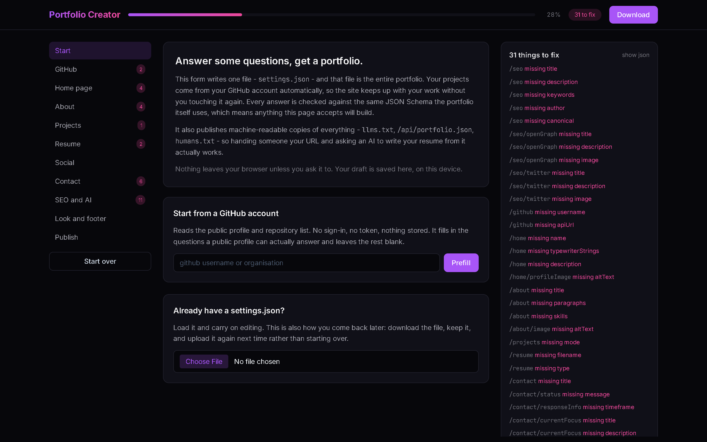
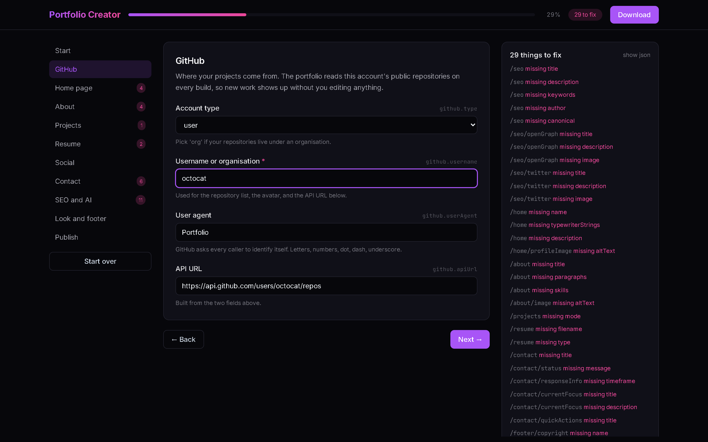
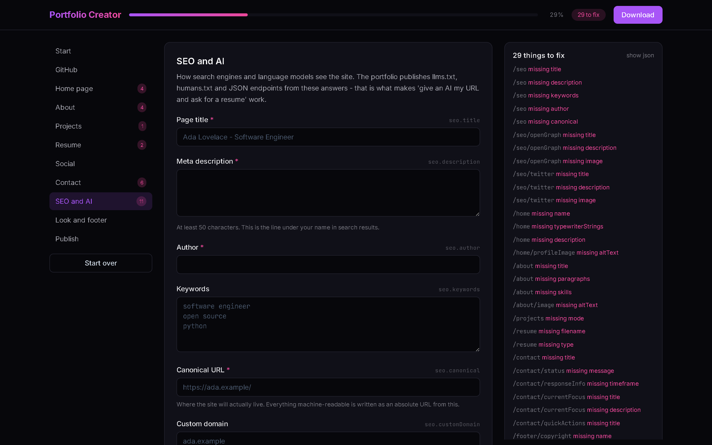
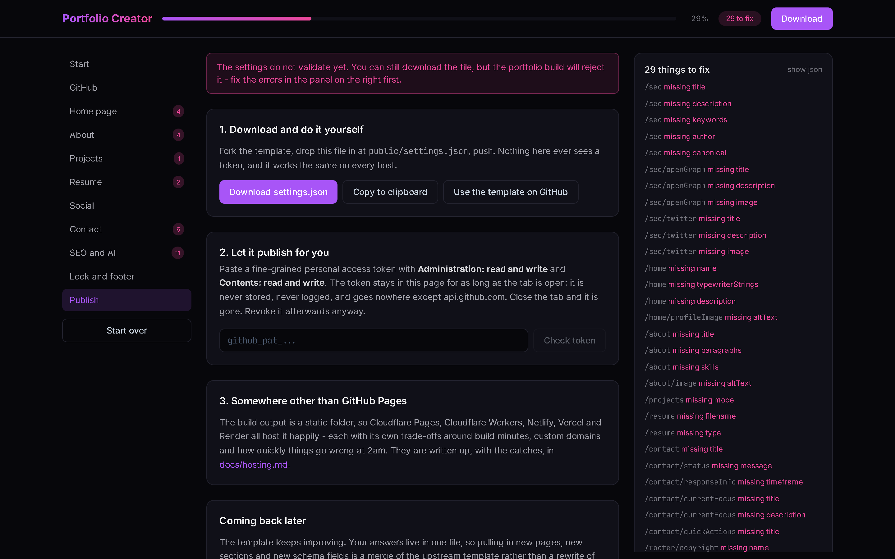

# Portfolio Creator

Fill in a form, get a portfolio.

**→ [Open the app](https://life-experimentalist.github.io/portfolio-creator/)**

This is a guided form that writes one file — `settings.json` — and that file is
the entire portfolio. Everything else is already built: pages, routing, dark
mode, animations, an SEO head, a sitemap, and a project list that reads itself
out of your GitHub account so the site keeps up with your work without you
touching it again.

It runs entirely in your browser. There is no backend, no account, and no
database. The only network calls it makes are to `api.github.com`, and only
when you ask for them.



<details>
<summary>More of it</summary>

**Answering a section.** Every question is one key in `settings.json`; the panel
on the right is the schema's opinion of your answers, updating as you type.



**SEO and AI.** Three switches decide who may read the site: search engines, AI
training crawlers, and the machine-readable copies of your data.



**Publishing.** Download it, let a token do it, or take the file somewhere else
entirely.



</details>

---

## Why a form and not a template to edit

A template you edit by hand goes stale. You change a colour, the upstream adds
a page, and now merging is a chore you will not do — so you do not, and the
site quietly rots.

Here your answers live in one file that nothing else touches. Pulling in new
pages, new sections and new schema fields is a merge of the template rather
than a rewrite of your site. Come back to this form later and it will show you
the new questions.

The form is checked against the **same JSON Schema the portfolio itself uses**,
split across `public/schemas/settings/`. There is no second set of rules to
drift out of sync: if this page accepts your answers, the portfolio will build.

---

## What you get

- **Projects that update themselves.** The portfolio reads your public
  repositories at build time. Push something new and it appears.
- **A résumé an AI can read.** The build publishes `llms.txt`, `humans.txt` and
  `/api/portfolio.json`, `/api/projects.json`, `/api/about.json`,
  `/api/contact.json`. Hand someone your URL, ask a model to write your résumé
  from it, and there is something real for it to read — not scraped HTML.
- **Crawling you control.** Three switches: search engines, AI training
  crawlers, and the machine-readable data above. Off means off, written into
  `robots.txt`.
- **A copy-this-page button**, so a visitor can take your whole portfolio as
  Markdown in one click.
- **No hardcoded anybody.** Every piece of identity on the site comes from
  `settings.json`. The starter this form begins from is derived from a real
  portfolio with the owner stripped out — and the derivation script *fails* if
  a single trace survives.

---

## Three ways to publish

1. **Download and do it yourself.** Fork the template, drop `settings.json`
   into `public/`, push. No token, works everywhere.
2. **Let it publish for you.** Paste a fine-grained personal access token; it
   creates the repository, commits your settings and turns on Pages. The token
   lives in the page for as long as the tab is open — never stored, never
   logged, never sent anywhere but `api.github.com`.
3. **Somewhere other than GitHub.** See **[docs/hosting.md](docs/hosting.md)**
   for GitHub Pages, Cloudflare Pages, Cloudflare Workers, Netlify, Vercel and
   Render, with the trade-offs that actually matter.

### Why there is no "Sign in with GitHub" button

A browser-only OAuth flow cannot complete against github.com — the token
endpoint sends no CORS headers, and no amount of client-side code gets around
that. The honest options are a token you paste, or a small server doing the
exchange. A Cloudflare Worker is about thirty lines and is written up in the
hosting doc; until that exists, a scoped token you revoke afterwards is
strictly safer than a long-lived OAuth grant anyway.

---

## Running it locally

```bash
npm install
npm run dev
```

| Script | What it does |
|---|---|
| `npm run dev` | Vite dev server |
| `npm run build` | Builds to `dist/`, then writes `robots.txt`, `sitemap.xml` and `humans.txt` |
| `npm run preview` | Serves the built output |
| `npm run lint` | ESLint |

Two environment variables matter at build time: `BASE_PATH` (for a project-page
subpath, e.g. `/portfolio-creator/`) and `SITE_URL` (what the sitemap
advertises). The Pages workflow sets both.

---

## How it is put together

```
src/data/steps.js       the form, as data: steps → fields → dotted paths
src/data/starter.json   a blank, schema-valid settings.json (generated)
src/lib/schema.js       Ajv over the portfolio's own split schema
src/lib/settings.js     get/set by dotted path, export formats
src/lib/github.js       api.github.com, client-side only
src/lib/derive.js       fields worked out rather than asked about twice
src/components/         generic renderers — nothing knows what a field means
scripts/derive-starter.js  regenerates the starter from a real settings.json
scripts/generate-seo.js    post-build crawlable files
```

Adding a question to the form is adding an entry to `steps.js`. The renderers
are generic and the schema is the validator, so there is nothing else to
change.

### Regenerating the starter

```bash
node scripts/derive-starter.js ../VKrishna04.github.io/public/settings.json
```

It keeps the structure and every styling default, empties what carries a
person, **deletes** keys that cannot legally be blank (rather than inventing a
placeholder), and then sweeps the result for any trace of the source
portfolio's owner. It exits non-zero if it finds one, or if a remaining gap is
not a question the form actually asks.

### Regenerating the share card

`public/og.png` is the 1200×630 card that appears when the link is pasted into
Slack, Discord or X. Its source is `scripts/og.html` — edit the words there and
screenshot it at exactly 1200×630. The screenshots above are the app itself at
1440×900, taken with a headless browser; nothing about either is load-bearing,
so a stale one costs you nothing but a slightly old picture.

---

## Credits

Designed & built by **[Krishna GSVV](https://github.com/VKrishna04)**.

Built on the [portfolio template](https://github.com/VKrishna04/VKrishna04.github.io)
— [see one live](https://vkrishna04.me).

Licensed under Apache 2.0. Attribution is required by the template's `NOTICE`
under Apache License 2.0 section 4(d): keep the credit, and the rest is yours
to change.

Sister projects worth switching on:
[CodeLedger](https://github.com/Life-Experimentalist/CodeLedger) for DSA
practice statistics, and [CounterAPI](https://counterapi.dev) for a visitor
count that does not track anyone.
